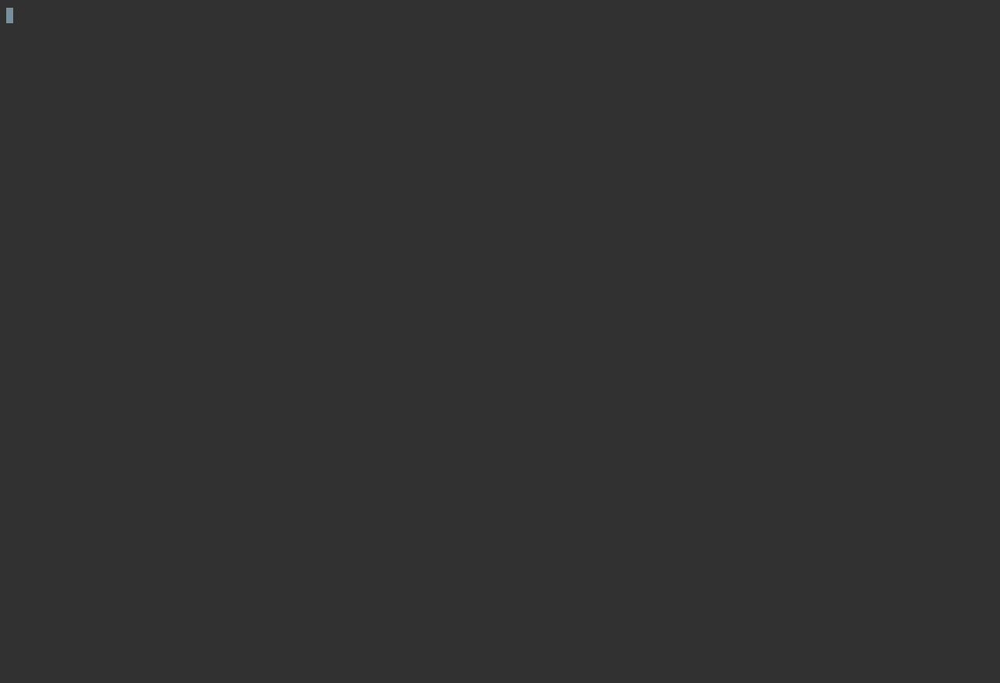
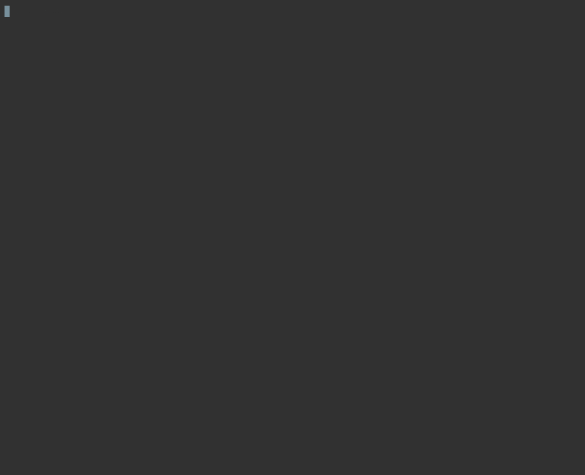

# arch-local

This repo contains a local arch-network development stack, as well as some example programs.

## Requirements:
- [Docker](https://www.docker.com/)
- [Rust](https://www.rust-lang.org/)
- A C++ Compiler (gcc/clang)
- [RISC0 Toolchain](https://www.risczero.com/) (instructions below)

## Getting Started

Here you will find instructions on how to run the local Arch Network development environment. You'll also learn how to compile and run the `helloworld` example program.

### Environment
The core components are outlined below to help paint a model for how applications interact with Arch and the Bitcoin network.

#### Nodes
1. [The Bootnode](https://github.com/Arch-Network/arch-local/blob/main/compose.yaml#L2)
    
    This node is the entrypoint for other nodes and serves as the leader/coordinator of the network. All signing is coordinated by the leader. Ultimately, the leader submits signed Bitcoin transactions to the Bitcoin network following program execution.
    
2. [The Validator Node](https://github.com/Arch-Network/arch-local/blob/main/compose.yaml#L38)
  
    This node represents a generic node operated by another party. It performs the validator role and has a share in the network's distributed signing key. The leader node passes transactions to validator nodes to validate and sign. After enough signatures have been collected (a threshold has been met), the leader can then submit a fully signed Bitcoin transaction to the Bitcoin network.
    
3. [The zkVM](https://github.com/Arch-Network/arch-local/blob/main/compose.yaml#L68)
  
    This node represents the execution environment for the smart contracts that normally runs on the leader's hardware. The leader sends the program request to the zkVM which executes it and generates outputs (execution receipts) as a result of these computations; the results are then shared back to the leader.

    The leader node then submits the receipts, program data, and completed state transitions to the validator pool to validate and sign.

    More can be read about the Arch Network architecture in our [docs](https://arch-network.gitbook.io/arch-documentation/fundamentals/arch-architecture).

### 1 - Start the Development Stack
- Clone this git repository. 

You'll find a `compose.yaml` file. This is a descriptor for the multi-container arch-network stack. It contains a pre-configured definition of the components required for local development.
- Make sure that Docker is up and running. Start the stack by running the following command:
```bash
docker compose up
```

#### Initializing nodes


**NOTE:** If you encounter an error like the following: `no matching manifest for linux/arm64/v8 in the manifest list entries`, ensure that you have first set your `DOCKER_DEFAULT_PLATFORM` environment variable within `.bashrc` or `.zshrc` to be the correct architecture of your machine. 

```bash
# Eg, for Apple-Silicon users:
export DOCKER_DEFAULT_PLATFORM=linux/amd64
```

### 2 - Compile and Run the `helloworld` example program

### 2.1 - Install RISC0-Toolchain

To compile the examples, the risc0 Rust toolchain must be installed. Execute the following commands to install the toolchain to your local system.

```bash
cargo install cargo-binstall
cargo binstall -y cargo-risczero@0.21.0
cargo risczero install
```

### 2.2 - Compile and run the example program
- Access the `examples/helloworld` folder:
```bash
cd examples/helloworld
```
- Build the example program
```bash
cargo build
```
- This will compile the example program into an RISC-V ELF file (the executable format expected by the ZKVM). You'll find the generated file at: `./target/program.elf`
- Submit a test arch-network transaction, executing the `helloworld` program: 
```bash
cargo test -- --nocapture
```

**NOTE:** If you encounter an error like the following: `linking with cc failed`, you may need to update your `~/.cargo/config` to include the correct architecture of your machine:
```bash
[target.x86_64-apple-darwin]
rustflags = [
  "-C", "link-arg=-undefined",
  "-C", "link-arg=dynamic_lookup",
]

[target.aarch64-apple-darwin]
rustflags = [
  "-C", "link-arg=-undefined",
  "-C", "link-arg=dynamic_lookup",
]
```

#### Demo

##### `cargo test -- --nocapture`


##### Node logs


## Useful Resources

-  mempool.space -> https://mempool.dev.aws.archnetwork.xyz 
   -  Bitcoin mempool and blockchain explorer. This mempool.space instance monitors the regtest Bitcoin blockchain being used to run and validate all examples in this repo.
