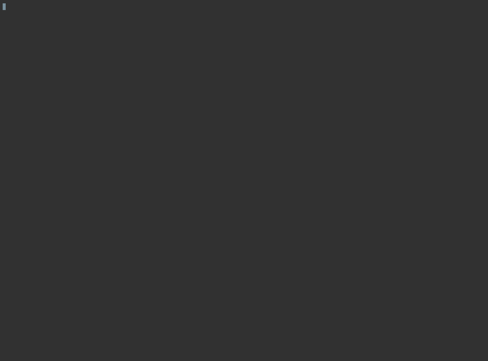
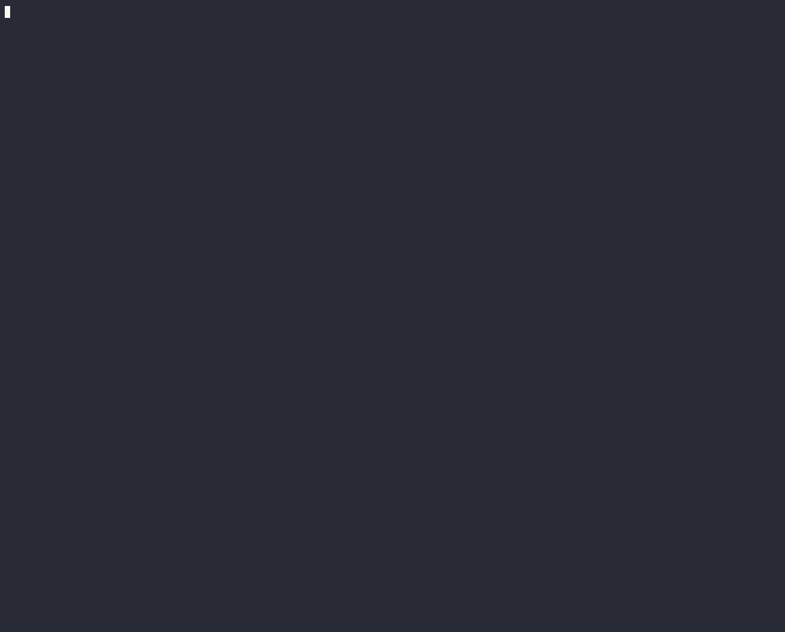

# arch-local

This repo contains a local arch-network development stack, as well as some example programs.

## Requirements:
- [Rust]
- [Docker]
- [Solana CLI](#21---install-solana-cli)
- [A C++ Compiler (gcc/clang)](#22---install-c-compiler)

## Getting Started

Here you will find instructions on how to run the local Arch Network development environment. You'll also learn how to compile and run the `helloworld` example program.

### Environment
The core components are outlined below to help paint a model for how applications interact with Arch and the Bitcoin network.

#### Nodes
1. [Bootnode]

    The bootnode works similarly to DNS seeds in Bitcoin whereby the server handles the first connection to nodes joining the Arch Network.

2. [Leader]

    All signing is coordinated by the leader. Ultimately, the leader submits signed Bitcoin transactions to the Bitcoin network following program execution.
    
3. [Validator]
  
    This node represents a generic node operated by another party. It performs the validator role and has a share in the network's distributed signing key. The leader node passes transactions to validator nodes to validate and sign. After enough signatures have been collected (a threshold has been met), the leader can then submit a fully signed Bitcoin transaction to the Bitcoin network.

    The validator node also runs the [eBPF] virtual machine and executes the transactions asynchronously alongside the other validator nodes in the network.
    
    More can be read about the Arch Network architecture in our [docs].

## 1 - Start the Development Stack
- Clone this git repository. 

You'll find a `compose.yaml` file. This is a descriptor for the multi-container arch-network stack. It contains a pre-configured definition of the components required for local development.
- Make sure that Docker is up and running. Start the stack by running the following command:
```bash
docker compose up
```

**NOTE:** If you encounter an error like the following: `no matching manifest for linux/arm64/v8 in the manifest list entries`, ensure that you have first set your `DOCKER_DEFAULT_PLATFORM` environment variable within `.bashrc` or `.zshrc` to be the correct architecture of your machine. 

```bash
# Eg, for Apple-Silicon users:
export DOCKER_DEFAULT_PLATFORM=linux/amd64
```

### Initializing nodes


## 2 - Compile and run the `helloworld` example program

### 2.1 - Install Solana CLI

To compile the examples, the [Solana] CLI toolchain must be installed. Execute the following commands to install the toolchain to your local system.

#### MacOS & Linux

```bash
sh -c "$(curl -sSfL https://release.solana.com/v1.18.18/install)"
```

> You can replace v1.18.18 with the release tag matching the software version of your desired release, or use one of the three symbolic channel names: stable, beta, or edge. 
>
> Ref: [Solana Docs].

### 2.2 - Install C++ Compiler

For MacOS users, this *should* already be installed alongside [gcc] so you can skip this section.

For Linux (Debian/Ubuntu) users, this must be installed if it isn't already. We will manually install the gcc-multilib.
```bash
sudo apt-get update
sudo apt-get install gcc-multilib
```

⚠️ **NOTE:** If you are a Linux user and do not already have gcc-multilib installed you will see an error like the below when trying to execute `cargo-build-sbf`.

```bash
cargo:warning=/usr/include/stdint.h:26:10: fatal error: 'bits/libc-header-start.h' file not found
  cargo:warning=   26 | #include <bits/libc-header-start.h>
  cargo:warning=      |          ^~~~~~~~~~~~~~~~~~~~~~~~~~
  cargo:warning=1 error generated.
```

### 2.3 - Compile and run the example program
- Access the `examples/helloworld/program` folder:
```bash
cd examples/helloworld/program
```
- Build the example program
```bash
cargo-build-sbf
```

> ⚠️ **NOTE:** Installing [rust] through [Homebrew] likely leads to issues working with `cargo-build-sbf`. 
>
> Below are some steps to get around this.

#### Steps:

- Uninstall rust
```bash
rustup uninstall self
```

- Ensure rust is completely removed
```bash
rustup --version

# should result:
zsh: command not found: rustup
```

- Reinstall rust
```bash
curl --proto '=https' --tlsv1.2 -sSf https://sh.rustup.rs | sh
```

- Reinstall solana
```bash
sh -c "$(curl -sSfL https://release.solana.com/v1.18.18/install)"
```

- Run `cargo-build-sbf` command again
```bash
cargo-build-sbf
```

> If you are still experiencing errors, join our [Discord dev-chat] channel for more support.

### Build program


- This will compile the example program into a eBPF ELF file (the executable format expected by the Arch virtual machine). You'll find the generated shared object file at: `./target/deploy/helloworldprogram.so`
- Submit a test arch-network transaction, executing the `helloworld` program:
```bash
# return to the helloworld dir and run test
cd .. && cargo test -- --nocapture
```

**NOTE:** If the test succeeds, you should be presented with the following:
```bash
test tests::test_deploy_call ... ok

test result: ok. 1 passed; 0 failed; 0 ignored; 0 measured; 0 filtered out; finished in 77.21s

   Doc-tests helloworld

running 0 tests

test result: ok. 0 passed; 0 failed; 0 ignored; 0 measured; 0 filtered out; finished in 0.00s
```

**NOTE:** If you encounter an error like the following: `linking with cc failed`, you may need to update your `~/.cargo/config` to include the correct architecture of your machine:
```bash
[target.x86_64-apple-darwin]
rustflags = [
  "-C", "link-arg=-undefined",
  "-C", "link-arg=dynamic_lookup",
]

[target.aarch64-apple-darwin]
rustflags = [
  "-C", "link-arg=-undefined",
  "-C", "link-arg=dynamic_lookup",
]
```

## Useful Resources

- [mempool.space] 
   -  Bitcoin mempool and blockchain explorer. This mempool.space instance monitors the regtest Bitcoin blockchain being used to run and validate all examples in this repo.
- [Solana Cli]
- [Solana Local Development Guide]


[gcc]: https://gcc.gnu.org/
[docs]: https://docs.arch.network
[Rust]: https://www.rust-lang.org/
[ebpf]: https://ebpf.io/
[Docker]: https://www.docker.com/
[Homebrew]: https://brew.sh/
[Solana]: https://github.com/solana-labs/solana
[Solana Docs]: https://docs.solanalabs.com/cli/install#macos--linux
[Solana Cli]: https://docs.solanalabs.com/cli/install
[Solana Local Development Guide]: https://solana.com/developers/guides/getstarted/setup-local-development
[Bootnode]: ./compose.yaml#L2
[Leader]: ./compose.yaml#L19
[Validator]: ./compose.yaml#L51
[Discord dev-chat]: https://discord.com/channels/1241112027963986001/1270921925991989268
[mempool.space]: https://mempool.dev.aws.archnetwork.xyz 
